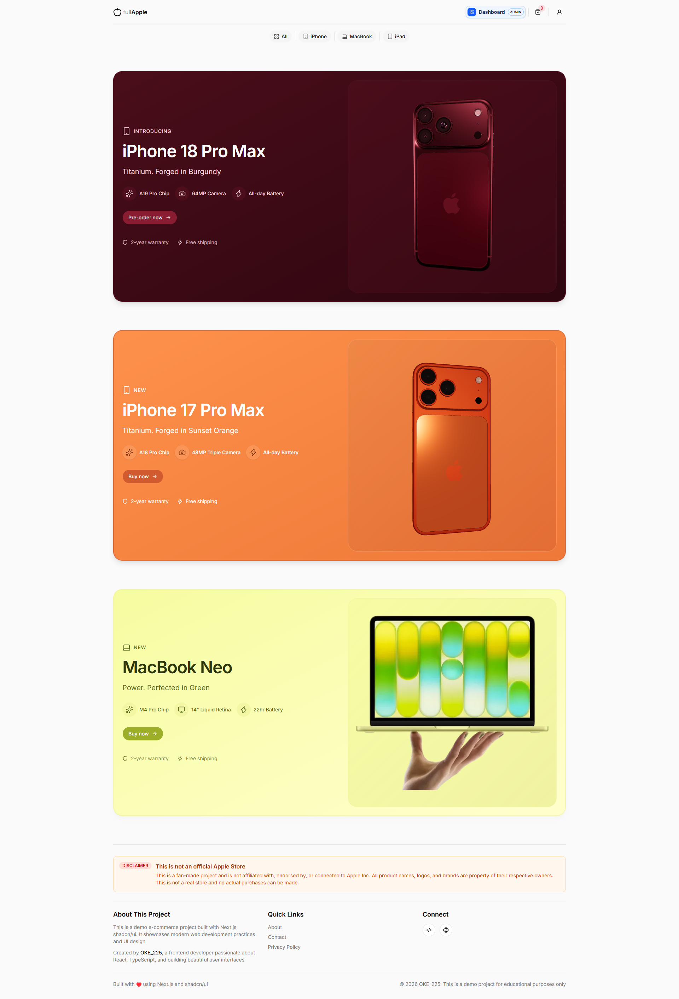
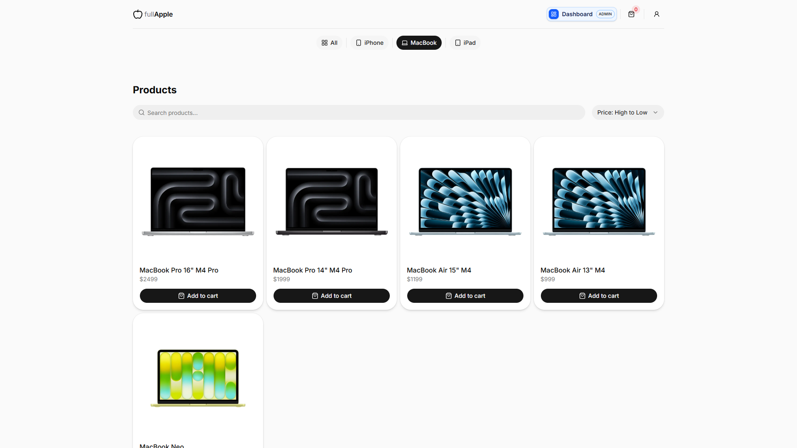
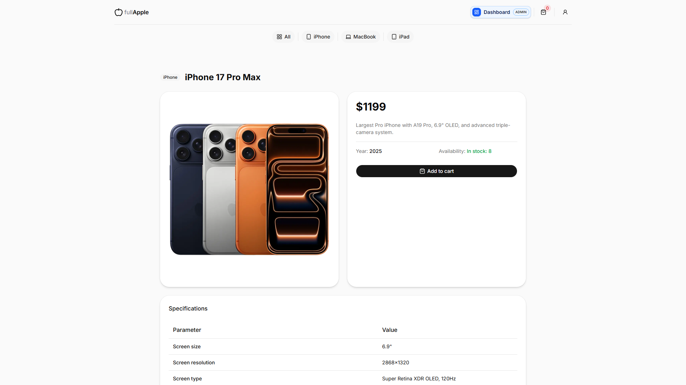
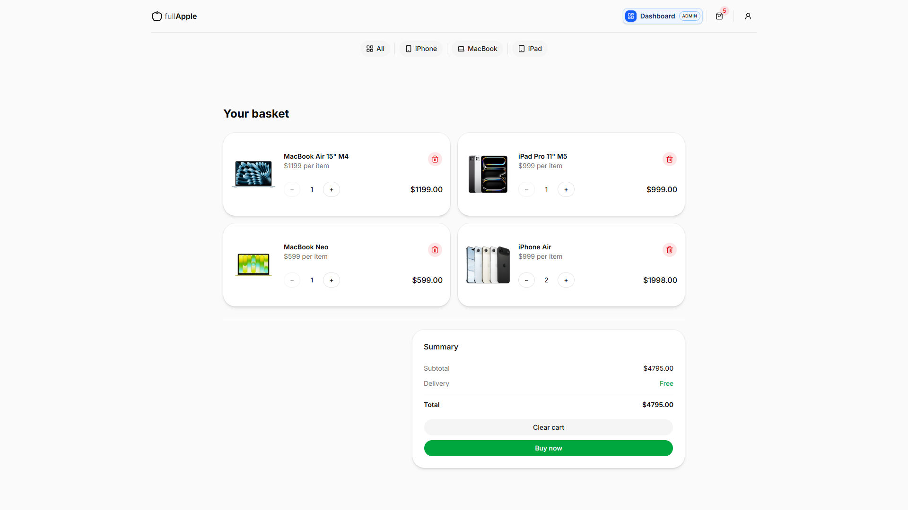
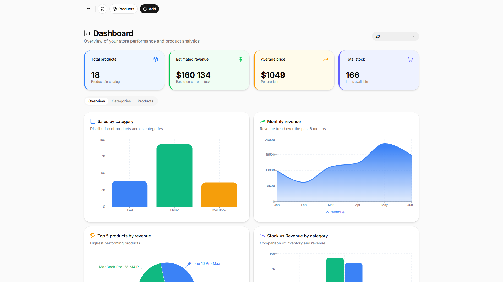
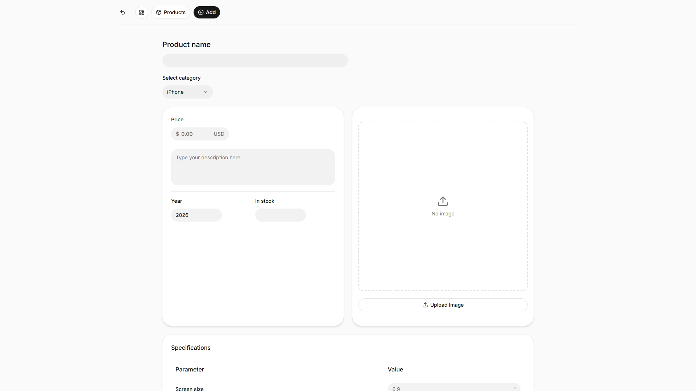

# 🍏 fullApple - E-commerce

FullApple is an unofficial Apple-themed e-commerce project built with Next.js and Supabase. This is not a real store and has no affiliation with Apple Inc. — it's a learning project showcasing modern web development

The platform features a product catalog where users can browse items by category, view detailed specifications, and add products to a shopping cart with real-time updates. Interactive 3D product models. Users can sign up and sign in using Supabase Auth, with protected routes ensuring secure access

An admin dashboard allows authorized users to manage the entire product catalog. Admins can add new products, edit existing ones, and delete items with a confirmation dialog. The system includes image upload with automatic square cropping, detailed product specifications (screen, CPU, RAM, battery, dimensions, weight), and server-side form validation

Security is handled through role-based access control and Supabase's Row Level Security policies at the database level. The application is fully responsive and optimized for all screen sizes, with loading states and hover effects. The database consists of four main tables: `categories`, `products`, `related_products`, `user_roles`

[**➥ Live**](https://ecommerce-full-apple-3d.vercel.app)

## ⚙️ Technologies

## ⭐ Key Features

- User authentication (sign up, sign in, sign out) with Supabase
- Product browsing by category (iPhone, MacBook, iPad, All)
- Product search and sorting
- Shopping cart with real-time updates
- Interactive 3D model viewer (iPhone 18 Pro Max and iPhone 17 Pro Max)
- Admin dashboard for product management
- CRUD operations for products
- Role-based access control
- Responsive design for all devices
- Database security with RLS
- Modern design with Shadcn UI

## 🔎 See Also

- [My Website](https://pj-portfolio-cv.vercel.app)
- [My GitHub profile](https://github.com/OKE225)
